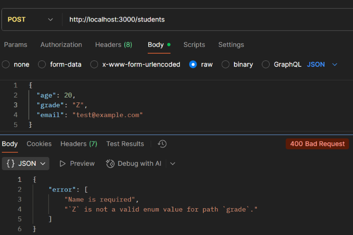

# Experiment 10: Add Mongoose Schema Validation (CO3, CO6)

---

## Screenshots

Here’s a preview of the app:


 
## 🎯 Objective
- Define schema validations in Mongoose.  
- Ensure required fields are provided.  
- Validate email format.  
- Handle validation errors gracefully.  

---

## ⚙ Setup

```bash
mkdir mongoose-validation
cd mongoose-validation
npm init -y
npm install express mongoose body-parser
